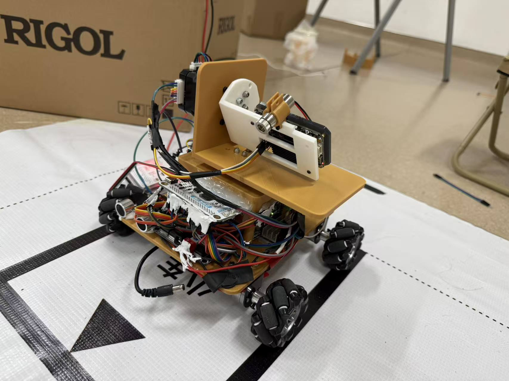

# K230 Vision Obstacle Avoidance Car



基于嘉楠 K230 / CanMV 的视觉避障小车项目。程序通过摄像头识别红色障碍物，并结合黑色地贴赛道边界构造图像空间走廊，判断障碍物是否位于车辆通行区域内，再通过 UART3 与 TI 主控通信，完成阶段式避障控制。

## 项目结构

```text
k230-vision-obstacle-avoidance-car/
├── README.md
├── src/
│   └── k230_red_obstacle_detector_fixed_corridor.py
├── docs/
│   └── project_report.pdf
└── images/
    └── car_demo.jpg
```

## 功能特点

- K230 摄像头实时采集 320 x 180 图像。
- 基于 LAB 阈值检测红色瓶盖、标签等红色特征。
- 将多个红色特征合并并推断为完整瓶状障碍物。
- 使用两条固定或标定得到的黑色地贴边界线构造通行走廊。
- 判断障碍物底部中心点是否落入走廊区域。
- 通过 UART3 与 TI 主控进行阶段协议通信。
- 支持相机调试、走廊调试、瓶体检测调试等显示模式。

## 硬件环境

- K230 / CanMV 视觉模块
- TI 主控板或其他下位机控制器
- 小车底盘与电机驱动
- 红色障碍物，例如红色瓶盖或红色标签瓶
- 黑色地贴赛道边界

默认 UART3 接线：

| K230 引脚 | 功能 |
| --- | --- |
| IO32 | UART3_TXD |
| IO33 | UART3_RXD |

默认串口参数：

```text
UART_ID = 3
UART_BAUDRATE = 115200
UART_TX_PIN = 32
UART_RX_PIN = 33
```

## 通信协议

TI 到 K230 使用两字节命令：

| 数据包 | 含义 |
| --- | --- |
| `0x12 0xFF` | 第一阶段开始，TI 执行开环路线 |
| `0x12 0x1B` | 第一阶段开环路线完成，K230 开始视觉反馈 |
| `0x13 0xFF` | 第二阶段开始，K230 停止视觉反馈 |

K230 到 TI 使用两字节反馈：

| 数据包 | 含义 |
| --- | --- |
| `0x12 0x00` | 前方走廊被红色障碍物阻挡，继续左移避让 |
| `0x12 0x01` | 走廊清空，可继续前进 |

## 快速使用

1. 将 `src/k230_red_obstacle_detector_fixed_corridor.py` 复制到 CanMV IDE。
2. 确认 K230 摄像头画面方向、分辨率和 IDE 预览正常。
3. 按实际接线检查 `UART_ID`、`UART_TX_PIN`、`UART_RX_PIN`。
4. 如果只想调试视觉，不想给底盘发送控制，将源码中的 `CAMERA_ONLY_TEST` 改为 `True`。
5. 在现场根据光照调节 `RED_THRESHOLDS` 和 `BLACK_THRESHOLDS`。
6. 如果使用固定赛道线，调节：

```python
CORRIDOR_MODE = "FIXED_LINES"
FIXED_LEFT_LINE_K = -0.36
FIXED_LEFT_LINE_B = 144.0
FIXED_RIGHT_LINE_K = 0.36
FIXED_RIGHT_LINE_B = 176.0
```

如果想自动从黑色地贴中拟合赛道线，可以切换为：

```python
CORRIDOR_MODE = "CALIBRATE_LINES"
```

## 主要参数

| 参数 | 作用 |
| --- | --- |
| `RED_THRESHOLDS` | 红色障碍物 LAB 阈值 |
| `BLACK_THRESHOLDS` | 黑色赛道线 LAB 阈值 |
| `OBSTACLE_ROI` | 红色障碍物检测区域 |
| `CORRIDOR_TOP_Y` / `CORRIDOR_BOTTOM_Y` | 走廊判断的纵向范围 |
| `BOTTLE_GROUP_MAX_CENTER_DX` | 合并同一瓶体红色特征的横向距离 |
| `BOTTLE_PADDING_*` | 从红色特征扩展到瓶体框的边距 |
| `SEND_FLAG_EVERY_N_FRAMES` | 串口反馈发送频率 |

## 调试建议

- 先使用 `DEBUG_VIEW_MODE = "RAW"` 确认画面正常。
- 再切换到 `DEBUG_VIEW_MODE = "BOTTLE"` 检查红色障碍物框是否稳定。
- 使用 `DEBUG_VIEW_MODE = "CORRIDOR"` 检查走廊边界是否覆盖小车实际通行区域。
- 若强光导致误检，优先收紧 `RED_THRESHOLDS` 中的 A 通道下限。
- 若地贴线断裂或拟合不稳，增大 `BLACK_LINE_MERGE_MARGIN` 或切换固定走廊线。

## GitHub 开源同步

你截图里的仓库已经创建好了，地址是：

```text
https://github.com/HxG949/k230-vision-obstacle-avoidance-car
```

### 方法一：网页上传

1. 在截图蓝色区域点击 `uploading an existing file`。
2. 打开本地文件夹：

```text
C:\Users\gjj20\Documents\New project\k230-vision-obstacle-avoidance-car
```

3. 进入这个文件夹后，选中里面的全部内容：`README.md`、`.gitignore`、`src`、`docs`、`images`。
4. 把这些文件和文件夹拖到 GitHub 上传页面。
5. 页面底部的提交信息填写：

```text
Initial open-source release
```

6. 点击 `Commit changes`。

这是目前最简单的方式，不需要本机安装 Git。

### 方法二：命令行同步

如果你安装了 Git，可以在项目目录执行：

```bash
git init
git add .
git commit -m "Initial open-source release"
git branch -M main
git remote add origin https://github.com/HxG949/k230-vision-obstacle-avoidance-car.git
git push -u origin main
```

如果推送时要求登录，按 GitHub 提示使用浏览器登录，或使用 GitHub Personal Access Token。

## 开源建议

项目展示图片位于 `images/car_demo.jpg`，当前已使用实拍小车照片。正式发布前可以继续补充更多调试截图、赛道照片或结构说明。

## License

首次开源建议使用 MIT License，便于他人学习、复现和二次开发。正式发布前可以根据比赛或学校要求再确认授权方式。
